# IA — DevCave 信息架构

> 版本：v0.1 | 日期：2026-08-02

---

## 1. 全局站点地图

```mermaid
graph TD
    Root["🏠 DevCave"]

    Root --> Auth["认证"]
    Root --> Main["主应用"]
    Root --> Settings["设置"]

    Auth --> Login["登录 /login"]
    Auth --> Register["注册 /register"]
    Auth --> OAuth["GitHub OAuth 回调"]

    Main --> Home["首页 Feed /"]
    Main --> Share["技术分享 /share"]
    Main --> Match["协作匹配 /match"]
    Main --> Tree["匿名树洞 /treehouse"]
    Main --> QA["技术问答 /qa"]
    Main --> Events["技术活动 /events"]
    Main --> Profile["个人主页 /u/:username"]

    Share --> ShareFeed["分享 Feed /share"]
    Share --> Editor["写作编辑器 /share/new"]
    Share --> ArticleDetail["文章详情 /share/:id"]

    Match --> MatchList["推荐列表 /match"]
    Match --> MatchProfile["用户技术档案 /match/u/:id"]
    Match --> MatchRequests["协作请求 /match/requests"]

    Tree --> TreeFeed["树洞 Feed /treehouse"]
    Tree --> TreePost["帖子详情 /treehouse/:id"]

    QA --> QAList["问答列表 /qa"]
    QA --> QANew["提新问题 /qa/ask"]
    QA --> QADetail["问题详情 /qa/:id"]
    QA --> QASearch["搜索结果 /qa/search"]

    Events --> EventList["活动列表 /events"]
    Events --> EventNew["发布活动 /events/new"]
    Events --> EventDetail["活动详情 /events/:id"]

    Profile --> MyPosts["我的内容"]
    Profile --> MyScore["我的积分"]
    Profile --> MyBadges["我的徽章"]

    Settings --> SettingsProfile["基础信息 /settings/profile"]
    Settings --> SettingsTech["技术档案 /settings/tech"]
    Settings --> SettingsNotify["通知偏好 /settings/notifications"]
    Settings --> SettingsPrivacy["隐私设置 /settings/privacy"]
```



---

## 2. 导航结构设计

### 2.1 主导航（左侧固定侧边栏）

```
┌─────────────────────────────┐
│  ◈ DevCave          [Logo]  │
├─────────────────────────────┤
│  🏠  发现 (Discover)         │  ← 首页 Feed
│  🔥  技术分享 (Share)         │  ← 分享模块
│  🤝  协作匹配 (Match)         │  ← 匹配模块
│  🌲  匿名树洞 (Treehouse)     │  ← 树洞模块
│  ❓  技术问答 (Q&A)           │  ← 问答模块
│  📅  技术活动 (Events)        │  ← 活动模块
├─────────────────────────────┤
│  [用户头像]  @username        │
│  Lv.3 中级工程师  ███░░ 980pts│
└─────────────────────────────┘
```

**导航栏规格**：
- 宽度：220px（展开）/ 60px（折叠，仅显示图标）
- 位置：左侧固定，`position: fixed; left: 0; top: 0; height: 100vh`
- 折叠触发：点击 Logo 左侧箭头图标
- 当前页高亮：左侧 3px 紫色指示线 + 文字/图标变亮

### 2.2 顶部导航栏（移动端）

```
┌──────────────────────────────────────────────────────┐
│  ◈  │  🔍 搜索...                        │  🔔  👤  │
└──────────────────────────────────────────────────────┘
```

- 仅在移动端（< 768px）显示
- 底部 Tab 栏替代左侧导航

### 2.3 全局顶部操作栏

```
┌──────────────────────────────────────────────────────────┐
│  [页面标题]                   [搜索] [通知🔔] [写作✏️] [头像]│
└──────────────────────────────────────────────────────────┘
```

- 高度：56px
- 固定顶部，左侧 margin 跟随侧边栏宽度自适应

---

## 3. 页面层级结构

### 3.1 层级深度规范

| 层级 | 说明 | 示例路径 |
|------|------|---------|
| L1 | 模块首页 | `/share`、`/qa`、`/events` |
| L2 | 内容详情页 | `/share/:id`、`/qa/:id` |
| L3 | 子功能页 | `/share/new`（编辑器）、`/qa/ask` |

**原则**：最多 3 层点击到达任意内容，L3 页面通过浏览器 Back 或面包屑返回。

### 3.2 模态层级（Overlay 层）

```
Z 轴层级（从低到高）：
  1. 页面背景内容（z-0）
  2. 固定导航栏（z-50）
  3. 下拉菜单 / Popover（z-100）
  4. 抽屉面板 Drawer（z-200）
  5. 对话框 Modal（z-300）
  6. Toast 通知（z-400）
```

**常用 Overlay 类型**：
- **右侧抽屉**：树洞帖子详情、活动筛选
- **底部抽屉**：移动端发帖表单
- **中心弹窗**：确认删除、报名成功
- **右下悬浮**：Tree/Events 的快速发布按钮

---

## 4. 数据流与状态管理

### 4.1 全局状态

```
GlobalState
├── auth            # 登录态、用户基础信息
├── notifications   # 未读通知数
├── userScore       # 当前积分（实时更新）
└── theme           # 暗色/亮色主题切换
```

### 4.2 页面级状态

| 页面 | 关键状态 |
|------|---------|
| Feed 首页 | `feedItems[]`、`page`、`feedType (follow/recommend)` |
| 编辑器 | `draftContent`、`previewMode`、`diffMode` |
| 匹配页 | `filters`、`matchList[]`、`requestStatus` |
| 树洞 | `emotionFilter`、`posts[]`、`anonymousId (session)` |
| 问答 | `sortBy (newest/votes)`、`tagFilter`、`myAnswers[]` |

---

## 5. URL 设计规范

| 路径模式 | 说明 |
|---------|------|
| `/share` | 技术分享 Feed 列表 |
| `/share/:id` | 文章/片段详情（`:id` 为 slug 或数字 ID）|
| `/share/new` | 新建编辑器页 |
| `/share/:id/edit` | 编辑已有文章 |
| `/qa` | 问答列表 |
| `/qa/ask` | 发起提问 |
| `/qa/:id` | 问题详情 |
| `/treehouse` | 树洞 Feed（无永久 URL 用于单帖，防止索引）|
| `/match` | 匹配推荐页 |
| `/events` | 活动列表 |
| `/events/:id` | 活动详情 |
| `/u/:username` | 用户公开主页 |
| `/settings/*` | 设置类页面 |

**URL 原则**：
- 树洞帖子不生成永久 SEO 可索引的 URL，防止匿名内容被检索
- 公开内容（文章、活动、问答）使用语义化 URL，支持 SEO

---

## 6. 空状态设计规范

每个列表页均需设计空状态（Empty State）：

| 模块 | 空状态文案 | 引导行动 |
|------|----------|---------|
| Feed 首页 | "关注一些人，发现更好的内容" | [探索热门内容] |
| 技术分享 | "还没有发布过内容" | [写第一篇文章] |
| 协作匹配 | "完善你的技术档案，找到更好的队友" | [完善档案] |
| 匿名树洞 | "今天还很平静 🌙" | [说点什么] |
| 技术问答 | "还没有这方面的问题" | [提一个问题] |
| 技术活动 | "这个城市暂时没有活动" | [发起第一个活动] |

---

*IA 版本历史*

| 版本 | 日期 | 变更 |
|------|------|------|
| v0.1 | 2026-08-02 | 初稿 |
